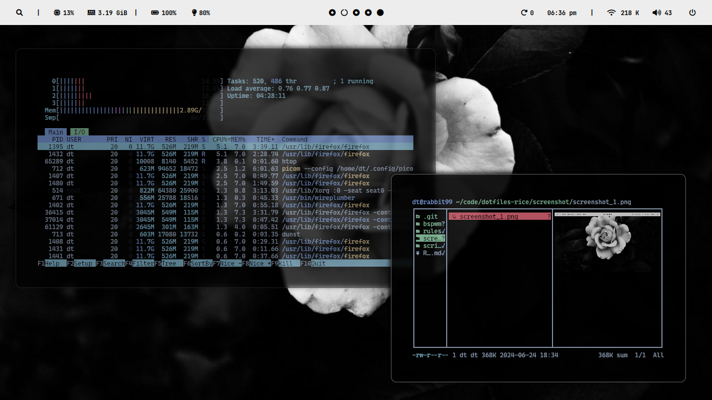

<!-- Title -->
<h1 align="center"><strong>Dotfiles</strong></h1>

<p align="center"> ━━━━━━ ❖ ━━━━━━ </p> 
<p align="center">
   
</p>
<p align="center"> ━━━━━━ ❖ ━━━━━━ </p> 
<!-- Description -->

<p align="center">Fully-featured floating/tiling window manager-based dotfiles for Arch Linux</p>
<p align="center">My floating/tilibg window manager-based dotfiles for ArchLinux</p>
<!-- Table of Contents -->

## Table of Contents

- [Introduction](#introduction)
- [Installation](#installation)
- [ScreenShots](#screenshots)
- [Keybindings](#Keybindings)
- [Contributing](#contributing)

<!-- Introduction -->

## Introduction

This repository includes dotfiles for customizing multiple aspects of a Linux system, such as window managers, terminals, file managers, browsers, editors, and additional configurations.

### Included Components:

| **Component**         | **Name**                                      |
| :-------------------- | :-------------------------------------------- |
| **Window Manager**    | [bspwm](https://github.com/baskerville/bspwm) |
| **Terminal Emulator** | [kitty](https://sw.kovidgoyal.net/kitty/)     |
| **File Manager**      | [ranger](https://ranger.github.io/)           |
| **Text Editor**       | [nvim](https://neovim.io/)                    |
| **Bar**               | [Polybar](https://github.com/polybar/polybar) |
| **Compositor**        | [Picom](https://github.com/yshui/picom)                         |

<!-- Installation -->

## Installation

**Note:** You need to be logged in as a regular user to use this script.

1. Install [Git](https://git-scm.com/) if you don't have it:

   ```bash
   sudo pacman -S git
   ```

2. Clone this repository:

   ```bash
   git clone git@github.com:xArcGit/dotfiles.git
   ```

   or

   ```bash
   git clone https://github.com/xArcGit/dotfiles.git
   ```

3. Navigate to the dotfiles directory:

   ```bash
   cd dotfiles
   ```

5. run the installtion script 
    ```bash
    chmod +x install.sh

    sudo ./install.sh
    ```

6. Restart your computer.

7. You're done! Now you can enjoy a my ricing for bspwm window manager on your computer.

**Note:** Edit the `.xinitrc` file and change display settings.

## Screenshots 

- `Shift` + `Super` + `w` for changing wallpaper
<p>
   
</p>

## Keynindings 
| Keys | Action |
|:-|:-|
|<kbd>super</kbd> + <kbd>Enter</kbd><br><kbd>super</kbd> + <kbd>s</kbd> | make terminal<br>Open a floating terminal.
|<kbd>alt</kbd> + <kbd>@space</kbd>| Display menu to select a theme.
|<kbd>super</kbd> + <kbd>@space</kbd>| Apps Menu.
|<kbd>super</kbd> + <kbd>alt</kbd> + <kbd>w</kbd>| Opens a menu to select a wallpaper.
|<kbd>super</kbd> + <kbd>h</kbd><br><kbd>super</kbd> + <kbd>u</kbd>|Hides bar/s<br>unhide bar/s
|<kbd>Print</kbd>| Takes screenshot.
|<kbd>ctrl</kbd> + <kbd>alt</kbd> + <kbd>[plus,minus,t]</kbd>| Changes transparency on focused window.
|<kbd>ctrl</kbd> + <kbd>super</kbd> + <kbd>alt</kbd> + <kbd>p</kbd><br><kbd>ctrl</kbd> + <kbd>super</kbd> + <kbd>alt</kbd> + <kbd>r</kbd><br><kbd>ctrl</kbd> + <kbd>super</kbd> + <kbd>alt</kbd> + <kbd>k| Power off computer<br>Restart computer<br>Brute kill a window/process
|<kbd>super</kbd> + <kbd>alt</kbd> + <kbd>r</kbd>| Restart bspwm.

And more.. You need to look sxhkdrc file for more.


## Contributing

Contributions are welcome! Please feel free to open an issue or submit a pull request.